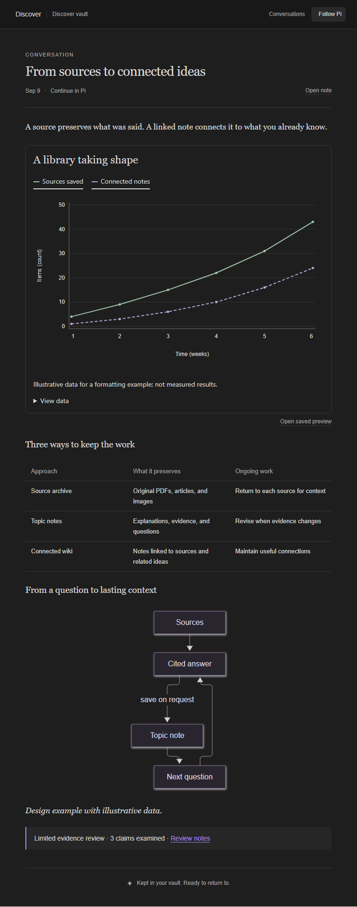

# Discover

**Write in Pi. Read, explore, and return to your ideas in Obsidian.**

Discover brings everyday questions and deep research into one lightweight workspace: a quiet Pi composer, a dark Obsidian reading pane, saved photos, and interactive charts. Ask a question, explore the answer, and save useful findings as linked notes when you want to keep them.

**Inactive until opened.** Installing Discover only registers its commands and inactive event handlers. It does not load its research runtime, inspect a vault, start agents, make network requests, change ordinary Pi tools or prompts, or alter the editor while closed. `/discover` (or an explicit conversation command such as `/discover deep`, `new`, or `resume`) opens it. Vault linking and companion installation perform only the requested setup and leave the composer inactive. `/discover exit`, Pi session changes, reload and shutdown close its sessions, stop work, and release its vault writer. A cancelled or failed activation leaves ordinary Pi input available.

Two focused runtime dependencies provide local PDF reading and PNG page previews: PDFium and pngjs (about 11.4 MiB unpacked together). The PDF worker runs only while reading requested pages. There is no database, server, telemetry or account system. Discover uses your existing Pi model access and ordinary files in your chosen vault. Substantial Deep answers can use one bounded evidence reviewer, running the same model selected in Pi.



*The actual companion UI, rendered with an illustrative conversation in a browser test harness.*

## Install

Requires Node 22.19+, **Pi 0.85.1** (the current supported SDK family), and Obsidian desktop. The Pi SDK is provided by Pi; installing a second copy is unnecessary.

```sh
pi install git:github.com/BasamAhmed640/pi-discover
```

For a private repository, Git must already be authenticated to the owning GitHub account. Restart Pi or use its extension reload command after installation.

The command is `/discover`. For Git-installed packages, Pi normally prefixes command descriptions with their source, such as `[u:git:github.com/BasamAhmed640/pi-discover]`. This is provenance metadata, not another command or a configuration error. Pi 0.85.1 does not provide a package display-name override for that prefix.

In Pi, explicitly link an **existing** Obsidian vault:

```text
/discover vault "C:\Notes\Discover"
```

Linking installs the bundled Obsidian companion automatically. Enable **Discover** once in Obsidian → Settings → Community plugins; its reading pane opens when you enable it. If needed, use **Discover: Open reading view** from Obsidian's command palette. Then run `/discover` in Pi and type normally. Pi keeps short status messages; full answers and visuals appear in Obsidian.

To update, run `pi update git:github.com/BasamAhmed640/pi-discover` in your shell, reload Pi, and open `/discover`. Opening checks the companion's three files and repairs missing or outdated files without rewriting unchanged files. Restart Obsidian or disable/re-enable Discover to load updated companion code. `/discover install-plugin` remains available as a repair command without opening a conversation. For an existing **Pi Research** installation, follow the upgrade instructions below.

The companion supplies the custom reading pane, interactive charts and checks of rendered layouts. Ordinary notes, tables, Mermaid diagrams, photos and static chart previews remain readable without it. Discover does not change Obsidian's restricted mode or enable other plugins. There is no separate plugin download, server or runtime build step.

The vault must be separate from Scholar's vault. Same, nested, and aliased roots are rejected. Vault linking is required; there is no default storage location. To change vaults, repeat `/discover vault "<other existing vault>"`. The original vault stays intact; content is never migrated or mixed automatically.

**All research content and view state live in the selected vault.** The machine-local Discover configuration contains only the selected vault path and ID. Pi's existing provider credentials stay in Pi's normal credential store. No conversation, source, photo, chart, or context is saved in this extension's installation folder.

## Use

Type `/discover` followed by a **space** to browse commands with descriptions, just like Scholar's command menu. Suggestions narrow as you type. `/discover help` shows the full guide, grouped by conversations, attachments, session, setup and recovery; `/discover help attach` shows usage for one command. Help and suggestions work before linking a vault and never start an agent. Opening `/discover` also shows a short reminder of the everyday commands.

| In Pi | Result |
| --- | --- |
| `/discover` | Enter Discover and reopen the last conversation |
| `/discover help [command]` | Show the full command guide or help for one command |
| `/discover ask` | Use direct answers with research when needed; the default |
| `/discover deep` | Investigate deliberately and compare primary sources |
| `/discover new A question worth exploring` | Start a new discussion |
| `/discover attach "photo.png"` | Stage a durable file attachment |
| `/discover clear-attachments` | Remove staged attachments from the next message |
| `/discover continue "Knowledge/a-topic.md"` | Select a note for a new linked discussion |
| `/discover resume` | Pick a saved conversation |
| `/discover fork <conversationID> <nativeEntryID>` | Start an independent branch through a saved message |
| `/discover stop` | Stop the current answer and preserve partial work |
| `/discover exit` | Restore ordinary Pi input |

**Ask** favors direct answers and research as needed. **Deep** calls for a more deliberate investigation, comparing primary sources and resolving disagreements where possible. The choice applies to the next turn and stays active until changed or Discover is closed. Both use the same lead agent, selected model and research tools. Ask has no automatic reviewer. Substantial Deep drafts receive one evidence review in a fresh session using that same model and thinking setting, followed by one correction pass when needed. The lead investigation has no hard token budget; the review has fixed limits. You can still describe the depth you want in your question.

**Provider-neutral:** Discover uses the provider and model selected in Pi through Pi's public SDK and model registry. This includes providers registered by Pi extensions; there are no hardcoded vendor models or separate vendor SDKs. Pi resolves authentication for each request, including existing OAuth logins, custom headers and endpoints. Credentials are not copied into the vault. Model capabilities still apply: image inspection needs image support, and Pi adjusts thinking settings to what the selected model supports. An unavailable provider produces an error instead of silently choosing another model.

Ask “remember this as a note” to save knowledge for later. The agent searches saved notes when relevant, without scanning the vault before every message.

Attach saved images with `/discover attach "photo.png"`. Structured image attachments supplied by Pi are also archived before model processing. Pi 0.85.1's native Alt+V paste inserts a temporary file path; automatic importing of that pasted path is not yet supported in Discover, so use the attachment command with that path. Image questions require a model that accepts images. PNG, JPEG, GIF, and WebP up to 8 MiB can be reloaded by the agent; archival supports files up to 50 MiB.

Attach a PDF with `/discover attach "paper.pdf"`, then ask about it normally. Discover reads selected pages, returns links to their original page numbers, and can inspect rendered page images for figures, tables and scans. Extracted text and previews stay in the vault and are reused. Text extraction does not preserve every layout detail; page images require a vision model. Automatic OCR and password unlocking are not included. Public PDF links are also supported, up to 20 MiB per download.

Requests such as “Compare these papers” or “Critique this argument” load focused instructions into the same agent. Comparisons use consistent dimensions and source references; critiques distinguish verified evidence, assumptions and unresolved gaps. There are no additional modes to configure.

Leave an active Scholar mode before entering Discover. The research model runs in a separate SDK session with an explicit tool list and global extension/context discovery disabled.

## A workspace you can return to

Opening any Obsidian note or chart is a local reading action. It makes no model request and does not switch Pi's active conversation. Use **Conversations** to browse saved work and **Follow Pi** to return to the live discussion. Charts work offline with series controls, hover details, and a data table. Reopening a chart starts with all series visible. Mermaid covers diagrams; ordinary Markdown and static chart previews remain readable without the companion.

Continuing a topic loads the selected note's current contents into a new linked discussion. Resuming a conversation restores its saved Pi history, including Pi's native compaction records. Related notes are read on demand. There is no separate AI-written checkpoint or automatic context injection from other conversations.

Context management is automatic in both Ask and Deep. As the model's context window fills, Pi summarizes older history and keeps recent messages, leaving room for the answer. It can do this during a research turn and continue working without another prompt. If a request exceeds the context limit, Pi can compact and retry it once automatically. Original messages, sources and attachments remain in the vault; reopening a conversation restores its saved compacted context. No compact command or context setting is required.

Discover now focuses those summaries on the current question, latest corrections, decisions, uncertainty and exact source/page/attachment/chart references. Native retention budgets scale down for smaller model windows and follow model changes. When something is missing or needs exact wording, either agent can use `recall_conversation` to retrieve original messages and evidence from the active branch, including history omitted by compaction. It excludes unpublished drafts and internal review feedback. Long saved sources can be read in bounded portions with `read_note` offsets. New image submissions retain internal vault references so the model can reopen them without cluttering the visible message. There is no background memory agent, database or MCP dependency.

Forking lets you try another direction from an earlier message. Open that message's note under `Conversations/<conversationID>/Messages/` in the vault and copy its `research_conversation` and `research_entry_id` properties into `/discover fork <conversationID> <nativeEntryID>`. `/discover branch` accepts the same arguments. The new conversation copies native history through that response and its publication record, keeping internal drafts hidden and preserving its review link. Later turns and unsent attachments are excluded. The source conversation stays intact.

When you ask to save a finding, it can become a source-backed knowledge note. Existing notes require a matching revision to update; conflicting edits are retained rather than overwritten. Previous knowledge revisions remain available. Ordinary answers stay in the conversation archive.

Each saved chart is an independent snapshot. Asking for changes creates a new chart, preserving the one in the earlier answer. Search results stay in native tool history; fetched original pages become readable source notes with provenance metadata.

The writing guide calls for direct openings, clear mechanisms and useful concrete examples or worked calculations. It instructs the model to remove filler, keep evidence and uncertainty explicit, and perform a brief writing self-check before sending. Both Ask and Deep use this guide. Deep’s reviewer also checks consequential explanatory gaps and unnecessary filler. Create `Style/Voice.md` in the vault to adjust the voice. See the [response engine and explanation principles](docs/response-engine.md), including their evidence and limits.

The companion stays dark, with neutral Obsidian-style charcoal surfaces, soft text, and a restrained purple accent. Charts and new exported previews stay dark too, regardless of the system theme. Styles are scoped to Discover.

### Evidence review

The reviewer examines up to six consequential claims against retrieved passages, original image/PDF page evidence, and chart specifications. It can retrieve more evidence but cannot edit notes, save visuals or publish answers. It also checks whether the explanation answers directly, connects necessary reasoning steps and avoids filler.

The reading pane quietly shows **Researching**, **Checking evidence**, **Refining answer** and **Checking layout** as needed. A reviewed final response links to a compact review report. Reports distinguish supported, incorrect, unsupported, qualified and unverified claims; no “fully verified” badge is used. Review failures are labeled incomplete. An interrupted draft stays saved without being presented as a finished answer; send another message to continue.

The reviewer gets at most four model requests, six retrieval calls and three minutes, with a 16,000 reported output-token budget and at most 8,000 output tokens per request. Its packet now includes a selective conversation brief, so a “continue” request can retain earlier corrections and scope. Current questions take priority over long drafts and evidence; omissions are recorded. Packet, image and per-request output caps shrink for smaller context windows. A conservative input estimate checks each review request, including growing tool results; exhaustion returns an incomplete review. One optional lead correction pass is also capped at four model requests and three minutes. The same model is used throughout. This adds tokens and latency to substantial Deep answers; Ask and short Deep answers avoid the reviewer. There are no new dependencies or services. These reviews target the final conversation response; knowledge notes and chart artifacts retain their existing save-time checks. See [context and agent implementation](docs/response-engine.md).

### Formatting before publication

`check_presentation` checks the actual answer Markdown. With the updated Obsidian companion open, it renders a temporary draft at 360px and 760px pane widths, then checks diagram/axis label size, overlap, clipping, content overflow, table readability, contrast and render errors. The agent is instructed to repair issues before sending a visual answer. Chart and knowledge-note saves also call the check in code and reject known formatting failures before publishing the note. Ask keeps streaming normally. Deep stages its draft, runs any evidence review, and checks the final layout in code before publication. Original drafts and tool history remain in the native session; the reading pane shows one published answer.

If Obsidian is closed or the companion cannot complete the check, the result is explicitly **unverified**, not a visual pass. Structural Markdown checks still run; valid content can be saved, and the agent is instructed to disclose the missing rendered check. The check is a layout safeguard, not a guarantee of aesthetic quality or factual accuracy. Temporary request files live under `_Research/presentation/` and are removed after a completed or cancelled check; interrupted requests expire and are ignored.

## Storage and recovery

```text
Your chosen vault/
  Conversations/<id>/    native session.jsonl, saved messages, readable transcript
    Reviews/<id>/        bounded evidence packet, reviewer session and report
  Attachments/           original photos and imported files
  Sources/               retrieved evidence; PDF page text and PNG preview caches
  Knowledge/             editable topic notes
  Visuals/<id>/          immutable chart spec, preview, offline HTML, note and metadata
  Style/                 optional voice guide
  _Research/             vault identity, knowledge revisions, streams and indexes
  .obsidian/plugins/pi-research/   Obsidian companion code
```

Native session entries are flushed as they are appended, including the first user message. Saved message records are immutable. Readable conversation indexes can be rebuilt without asking the model to rewrite an answer. Recovery fills identifiable gaps and does not replay tools or refetch sources. A single-writer lock prevents two Pi instances from concurrently editing the same research vault.

If a readable transcript needs rebuilding, `/discover repair` restores it from saved messages. Recovery commands are also listed by `/discover help`.

Copy the **whole vault** for portability, then relink it. If using a sync service, configure it to include JSON, JSONL, HTML, SVG, and original attachments. Do not assume its default filters include these files. For a copied vault with a stale writer lock from another computer, close that computer's Pi writer, then use `/discover unlock` on the new machine. A running local writer cannot be unlocked.

## Deliberate limits

- Web search and public page retrieval are built in. Search services may rate-limit or challenge automated requests; failures are reported. Logged-in browser automation is not included.
- Interactive visuals use a small declarative chart schema. Arbitrary model-written JavaScript is not executed inside Obsidian. There is no chart library or CDN dependency.
- At most one reviewer per Deep answer, with no recursive delegation or model-routing setup. No semantic database, PDF OCR, cross-vault search, or cloud synchronization service.
- The Obsidian companion uses an isolated frame for chart interaction. The Pi extension and Obsidian plugin themselves remain trusted local code, as with other extensions.

## Updating from Pi Research

Version 0.4.0 renames Pi Research to **Discover** and introduces `/discover`. If you installed the original repository, update that existing package entry:

```sh
pi update git:github.com/BasamAhmed640/pi-research
```

GitHub redirects the original repository address to `pi-discover`. Reload Pi and open `/discover` to refresh the companion, then disable and re-enable it in Obsidian so its name and interface update. Use `/discover` for commands; version 0.6.1 removes the old `/pi-research` alias from the command menu. There is no need to install a second copy or relink your vault.

The companion keeps its internal `pi-research` ID and directory so Obsidian retains its enabled state, reading panes and preferences. The existing vault pointer, `_Research` files, note properties and `research-visual` embeds also stay compatible. Your saved data is not renamed or migrated.

Ask/Deep, forks, automatic compaction, on-demand context and existing vault data remain supported. Existing exported HTML stays frozen; new charts and live embeds use the current renderer. The wiki integration remains a separate future addition. See the [feature audit](docs/feature-audit.md) for the current decisions.

## Development

```sh
npm ci --ignore-scripts --legacy-peer-deps
npm run build
npm test
npm run check
```

Tests use Node's built-in test runner. SDK integration tests use `PI_RESEARCH_SDK` when provided with a path to Pi's installed `dist/index.js`; this avoids installing another Pi copy. See [design decisions](docs/design.md) and [validation](docs/validation.md).

Edit `obsidian/plugin.cjs` and the shared `.cjs` modules, then run `npm run build` and commit the generated `obsidian/main.js`. esbuild is a development dependency only. The companion ships as one JavaScript bundle plus its manifest and stylesheet; users do not build it. `npm run check` rejects stale bundles. Keep minification disabled because the offline chart renderer serializes named functions into its sandboxed iframe.

Inspired by [Karpathy's LLM Wiki pattern](https://gist.github.com/karpathy/442a6bf555914893e9891c11519de94f) and the vault persistence lessons in pi-scholar. This implementation has its own namespace, data model, and runtime.
