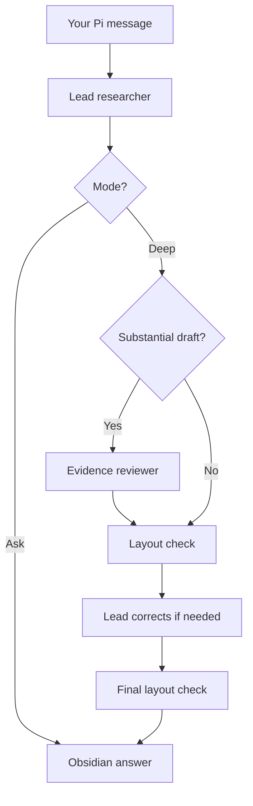

# Response engine and writing guide

Discover runs one lead agent in Pi’s SDK, using the model selected in Pi. Substantial Deep drafts can use one temporary evidence reviewer with that exact model and thinking setting. Ask uses the lead alone. The extension handles Discover input, so the ordinary Pi agent does not answer the same message as well.

Provider and model selection belong to Pi. The extension passes Pi's public model registry into the controller; a small adapter binds the selected provider's native stream methods and resolves current authentication through that registry for each request. The isolated runtime holds no credential copy or provider-specific configuration. This preserves custom providers, endpoints, headers and OAuth access without loading their unrelated extension hooks into research sessions. It does not depend on any particular vendor's model names or API shape. Image and reasoning behavior follows the model's capabilities.

The controller assembles the system prompt from the shared response guide, tool/evidence instructions, Ask or Deep, and the vault's optional `Style/Voice.md`. Pi supplies native conversation context. Relevant notes and sources are read on demand. The same agent can make several model requests while using tools; one agent does not imply one API call.

Native automatic compaction is always enabled for the Discover session, independently of the outer Pi session's settings. Pi uses the selected model's context limit to summarize older messages before the window fills. Discover retains Pi's normal reserve and recent-history budgets, capping each at one quarter of the selected model's window so small models do not inherit an impossible reserve. The settings follow model changes. Pi checks during tool-driven investigations as well as around user turns. A context-overflow error can trigger one automatic compact-and-retry attempt. The summary is appended to the vault's session history, and the model continues with that summary and retained recent messages. Original history is preserved and reopening uses the saved summary without regenerating it.

Inside the isolated session, a `session_before_compact` hook calls Pi's public `compact()` with its prepared cut point and current stream function. The normal summary structure is retained, with research instructions emphasizing current scope, latest corrections, decisions, uncertainty, unresolved disagreements and exact source/page/attachment/chart references. Both normal and split-turn summaries receive these instructions. This uses the selected provider and current authentication. It is the native summarization operation, not a second summarizer or new agent; a split turn can require two summary requests. If this operation fails, Pi's standard compaction is the fallback. Cancellation stops it. Summarization and fallback can cost tokens and fail if the provider is unavailable. No compaction system can guarantee an individually oversized input will fit.

## Context retrieval

The lead's working context is the native summary plus retained recent messages. The reviewer gets a separate bounded packet rather than the full transcript. Its conversation brief prioritizes recent original user messages, the opening request, the latest compaction summary, a recent published answer and selected-note/attachment context when space permits. These carry entry IDs and provenance; derived summaries and assistant answers are explicitly not independent evidence. This brief is assembled by ordinary code, without another model call. It is selective, not a complete or semantically ranked memory.

Both agents have `recall_conversation`. It searches original user messages, published answers, selected-note/attachment references and saved evidence tool results from the supplied native branch. It includes originals that compaction removed from live context, and only the ancestry actually copied into a fork. It never scans another conversation or follows the parent into later turns. This is a scope for conversation recall, not a permission boundary on the existing vault-wide note tools: `search_notes` and `read_note` can still read other vault notes when the task calls for them.

Recall uses local keyword matching with recency as a tie-breaker. With no query it returns recent excerpts; entry IDs and character offsets retrieve exact portions. Defaults are six matches and 6,000 text characters total, capped at twelve matches and 20,000 characters. Results label user statements, prior assistant prose and tool evidence separately. Unpublished drafts, internal review feedback, raw reasoning blocks and previous recall results are excluded. Source snapshots may still be incomplete or stale; an excerpt is not verification.

`read_note` also supports character offsets, allowing later portions of a saved source, text attachment or chart spec to be inspected without injecting the whole file. Every portion includes the full-file revision, total length and a continuation offset where needed. PDFs retain selected-page retrieval. New image submissions save their vault references in hidden context beside the original image history. Text recall does not inspect an image: visual claims still require `read_attachment` or PDF page images.

There is no database, embedding service, MCP server, background learner or automatic cross-conversation memory import. Durable context stays in native JSONL history in the linked vault. Context helpers run only inside an explicitly opened Discover session. Loading or linking the extension does not start an agent or memory process.

PDF extraction runs ordinary code in a short-lived worker. Presentation checking uses the Obsidian renderer and DOM measurements. Neither is an AI agent. Compare, critique and figure workflows are instructions loaded into the existing agent. There is no separate planner or writer agent; the evidence reviewer is the only supporting agent.

The model emits Markdown, Mermaid text and chart tool arguments. Discover saves original messages in native history. Ask streams normally. Deep keeps intermediate drafts out of the readable transcript, then publishes a single final answer with quiet review metadata. The companion renders that answer with its dark styles and interactive charts. The lead, rather than the UI, resolves the reviewer’s findings.

See the [activation and input handler](../src/extension.mjs), [controller](../src/controller.mjs), [response guide](../src/prompt.mjs) and [workflow recipes](../src/workflows.mjs).

## Reviewer scope and limits

The host reviews Deep drafts with at least 1,800 characters, or at least 500 characters when the turn read a source, PDF, note or image. This deliberately simple routing rule is a heuristic, not a measure of factual importance. Ask never pays for an automatic review; short Deep responses skip it.

The reviewer receives the current question first, followed by its draft, a conversation brief and recent evidence before older tool material. Text caps reserve room for the question and prior context instead of letting a long early fetch dominate. Every shortened or selectively omitted category is disclosed. Actual images have an explicit entry-to-image reference list, even when text space is exhausted. The reviewer has seven read/retrieve tools: web search, source fetch, PDF reading, image reading, note reading, note search and conversation recall. It has no publication, knowledge-editing, chart-writing, shell or delegation tool.

The maximum packet is 64,000 text characters and four images totaling 12 MiB. For smaller models, text is capped at 0.75 characters per context token, images at one per 16,000 context tokens, and each review response at one eighth of the window (never above the existing output cap or model output limit). These are conservative allocation heuristics, not provider tokenizers or proven optimal ratios. Before each review request, an input estimate includes messages, images, system instructions and tool schemas, with output room and safety headroom. An over-budget request is stopped locally and the review is labeled incomplete; source results are not silently removed from an ongoing tool exchange. Provider limits can still differ from the estimate.

The host allows four model requests, six retrieval calls, 16,000 reported output tokens (8,000 per request) and three minutes. Retry and compaction are disabled in this bounded, fresh worker. The lead retains native automatic compaction. A malformed or unfinished report is incomplete, never successful. Reported findings carry reasons and evidence references; they are model judgments, not independent proof.

The lead can make one correction pass, capped at four model requests and three minutes, to assess the findings and finalize the explanation. A clean review adds no correction call. Final Deep layout checks run in code, and known formatting failures prevent publication. An exact Markdown check from the current turn is reused; changed answers and later turns require a new check. Unavailable Obsidian rendering remains explicitly unverified. These limits constrain extra review work, not the initial research investigation.

All drafts, worker history and reports live in the linked vault. Native publication markers keep intermediate drafts hidden during replay. Forking from a published response includes its publication marker and preserves the report link, without replaying the review. Stopping cancels both sessions. An interrupted or broken final draft stays in native history without becoming a finished answer in the reading pane. Charts and requested knowledge saves retain their existing tool-time publication behavior; this review is not an atomic transaction over every artifact.

## Writing contract

- Answer the question in the opening sentences, including material uncertainty when necessary.
- Use plain language. Remove filler, praise, repeated conclusions and decorative structure.
- For explanations, connect the mechanism's steps and state the conditions under which they apply. An uncertain mechanism must remain uncertain.
- Connect an abstraction to a useful concrete example. For calculations or procedures, show enough intermediate steps to make the result understandable.
- Match the reader's knowledge and requested depth. A simple fact needs no lesson; an expert question still deserves technical detail.
- Keep observations, causal evidence, inference and assumptions distinct. Put qualifications and evidence beside the claim.

A brief instruction at the end of the system prompt asks the lead to review directness, explanatory gaps, evidence and dispensable sentences before sending. It then uses the existing presentation check when the final Markdown needs it. This self-check is prompt reinforcement, not model training, and adds no separate model request. The bounded Deep evidence review described above is a separate step.

The guide is refreshed by the existing `before_agent_start` hook on every submitted turn. Ask and Deep share it, as do tool continuations. `Style/Voice.md` remains available for personal writing preferences. Earlier saved answers are not rewritten.

## Evidence and limits

Removing irrelevant material and placing explanatory text near its graphic draw on the coherence and spatial-contiguity findings summarized by [Mayer and Fiorella](https://www.cambridge.org/core/books/abs/cambridge-handbook-of-multimedia-learning/principles-for-reducing-extraneous-processing-in-multimedia-learning-coherence-signaling-redundancy-spatial-contiguity-and-temporal-contiguity-principles/CD5B7AE1279A9AB81F8EEBB53DBEC86E).

Connecting concrete and abstract representations, using worked examples and explaining why are informed by the [IES practice guide on organizing instruction](https://ies.ed.gov/ncee/wwc/practiceguide/1). These studies concern learning and instructional materials. Applying them to conversational answers is a design inference, not evidence that this prompt has been experimentally validated or that one format is universally best. Automatic quizzes and spacing schedules are outside this general-question workflow.

The model remains responsible for following the guide. The local formatting checker measures layout, not truth or prose quality. SDK tests verify routing, tool permissions, same-model selection, publication, failure handling and persistence. A scripted test provider cannot establish that a real model produces better explanations or more accurate judgments. No live-model quality improvement or cost multiplier has been measured.

## Manual response checks

These are evaluation prompts and acceptance criteria, not reported model-test results. Compare the old and new prompts using the same model and settings. Judge correctness and whether the question is fully answered before considering brevity; the shortest answer is not automatically best.

| Prompt | A successful answer | Failure to watch for |
| --- | --- | --- |
| What does HTTP 404 mean? One sentence. | Direct meaning in one sentence | Greeting, history lesson, unnecessary diagram |
| Explain why a straw looks bent in water to a beginner. | Refraction at the boundary connected to apparent position | Naming refraction without explaining the effect |
| A survey links coffee drinking with productivity. Does coffee cause productivity? | Clear limits on causal inference and plausible confounding | Confident causal story from association |
| Explain how to convert 72 kilometres per hour to metres per second. | Conversion factors, cancellation and 20 m/s | Result alone or unnecessary theory |
| I know calculus. Explain why gradient descent can diverge. | Step size, local curvature and relevant mathematical conditions | Oversimplified metaphor or beginner preamble |
| Compare these two attached studies; one PDF is unreadable. | Access limitation up front, grounded comparison of available evidence | Inventing the missing study's methods or results |

Also check that Deep adds relevant investigation while keeping the conclusion easy to find, and that a requested detailed explanation retains the necessary detail.
